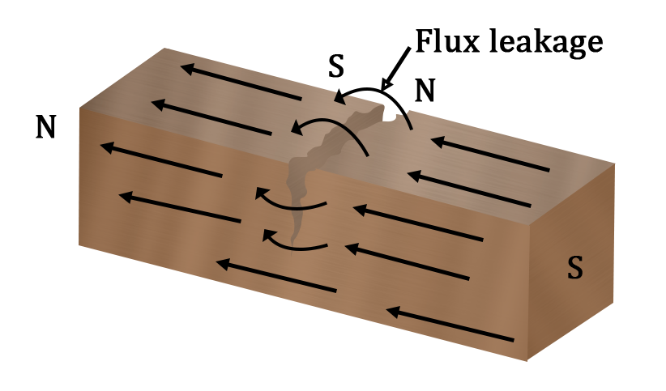

# Introduction:
***Non-destructive testing (NDT)*** is used to inspect the materials without causing any damage to the material. There are many non-destructive tests which work on various principles for detecting defects like cracks, voids and discontinuities of welded joints. NDT is mainly used in aerospace, automotive, manufacturing, and medical industries. NDT is the primary method for inspecting welded joints because it preserves the integrity and performance of the tested product. Different NDT techniques utilize diverse weld testing apparatus respectively. NDT technique can be selected depending on various factors like the type of welding, weld configuration and the surface quality of the joints. 
## Dye Penetrant Test:
 Dye penetrant test is one of NDT that is widely used for welded samples to find surface discontinuities. It is useful for the non-destructive inspection of ferrous and non-ferrous metals. This method is useful for identifying surface flaws like cracks and porosities

## Dye Penetrant Test Principle:
 This test works on the principle of capillary action. The suitable liquid penetrant is added to the surface being examined and left there for adequate time to allow the liquid to penetrate into any open surface imperfections. After the penetrant has had enough time to penetrate through the surface imperfections, any extra penetrant present on the specimen is cleaned. After that, a powdered absorbent called a developer is spread across the surface. The penetrant that had penetrated into the surface openings is blotted to the surface using this developer. To achieve this, it extracts some of the penetrants and uses it. As the colour of the developer changes above the surface defects, the defects or discontinuities are revealed.  The penetrant draws back and diffuses into the developer layer.
## Test Procedure:
1.	***Surface preparation***
 
 The first stage of dye penetrant testing is surface preparation, and for examining, the surface must be clean and free of any contaminants, including paint, grease, and oils. All contaminants and dirt particles should be removed from the surface. It is essential for the free flow of penetrant, to penetrate the flaws present in the component.

2. ***Penetrant Application***

 On the surface of the specimen, liquid penetrant is applied and permitted to penetrate any flaws for the duration of its dwell time. The dwell time is determined by penetrant properties such as viscosity (high viscosity requires a longer duration to flow on the surface), testing material, and size of the defect (smaller defects necessitate more time for penetrating). Specific gravity, microstructure characteristics, surface tension, dynamic viscosity, and contact angle of the penetrant all play a role in establishing the normal dwell time.

3.	***Removing Extra Penetrant:***

 The surface of the sample must be cleaned after the dwell time. This dwell time will ensure that, in case of presence of surface defects the penetrant will enter into the defect by capillary action. Any extra penetrant remaining should be removed thoroughly for preventing false detection. depending on the method of removing extra penetrant from the surface, various types of penetrant systems are present i.e. Lipophilic post-emulsifiable, hydrophilic post-emulsifiable, water-washable, and solvent-removable. 

4.	***Developer application:***

 After removing the extra penetrant, a thin powder coat which is usually white in colour, known as a developer, is applied. The developer is selected in accordance with the compatibility of the penetrant. The developer draws back the penetrant so that the crack present in the specimen can be seen. The term for this phenomenon is "bleeding out.". Developers can be applied to specimens by sprinkling, spraying, dusting, or dipping. The developer is not removed from the test surface for an adequate amount of time in order to extract the confined penetrant for visible indication. Typically, the minimum development time is 10 minutes, and the bleed-out reveals the defect's location, nature, and orientation.

5.	***Inspection:***

 Visible light is used for inspection in dye penetrant test.

6.	***Post-Cleaning:***

 After inspecting and marking the defects, thoroughly clean the surface, and the applied developer should be removed properly.

The important steps to undergo the dye penetrant test are shown in Figure 1 below.

#### Figure 1. Schematic representation of the Procedure of Dye Penetrant Test

 

## Characteristics of Penetrant:
  
  Penetrants of the dye penetrant should have the following properties:

1.	Visibility should be high for showing indications.
2.	Flowability should be high to flow easily on the surface.
3.	It cannot be hazardous.
4.	It should be drawn back easily after applying developer.

## Ultrasonic Testing:

Ultrasonic test is another commonly used NDT. This test uses high-frequency sound waves to characterize a test component's internal structure or thickness. It often employs frequencies in the 500 KHz–20 MHz range, which is well above the audible range of a human ear.

In general, ultrasonic testing is done by capturing and measuring either the waves that are reflected (pulse-echo) or the waves that are sent out (through transmission). Each of these two kinds is used for different things. Pulse-echo is better because it needs access to the object being checked from one side.
Metals, polymers, composites, and ceramics are commonly inspected using ultrasonic testing. Diagnostic imaging and medical research also extensively use ultrasonic technology in the biomedical field.

## Ultrasonic Testing Principle:
It employs high-frequency sound energy to examine and measure objects. It is utilised primarily for flaw detection, dimension measurements, etc. The ultrasonic testing system consists of a number of individual components, such as the transducer, pulser/receiver, and screen. A high-voltage electrical pulse can be generated using a specialized electronic device called a "pulser." It also acts as a receiver. The transducer is driven by a pulser to produce ultrasonic energy at very high frequencies. Sound is produced by applying this energy into a material and allowing it to travel as waves. A portion of the wave's energy is reflected from the surface of a crack or other irregularity in the path of the wave. As shown in Figure 2, the reflected wave signal is converted into an electrical signal by the transducer, which is then displayed on a screen. The distance a signal travels can be directly correlated with the signal's reflection.

#### Figure 2. Procedure of Ultrasonic testing

Ultrasonic Inspection has the following advantages that are listed below:
- It is very sensitive and can find flaws or defects below and on the surface.
- The fault detection or measurement depth is greater than competing NDT techniques.
- Minimal part preparation is required.
- In addition to flaw detection, it can also be used for measuring thickness.
 
Ultrasonic Inspection has the following limitations also that are listed below:
- Surface must be accessible for ultrasound transmission.
- A coupling medium is needed to make it easier for the sound energy to move into the test sample.
- Rough, irregularly shaped, very small, incredibly thin, or heterogeneous materials are challenging to inspect.
- If the defects are parallel to the sound beam, it may not be detected.

## Magnetic Particle Testing:

Magnetic particle Testing is used for detecting surface defects. It is comparatively quick and simple to apply, and surface preparation is minimal compared to other techniques. Due to its basic characteristics, it is one of the most popular non-destructive testing techniques.

It employs minute magnetic particles (such as iron filings) and magnetic fields to detect component defects. This NDT is limited to inspect defects of ferromagnetic materials such as alloys of iron, nickel, and cobalt.  Ferromagnetic substances are those that can be magnetically inspected effectively.

The Magnetic Particle Test can detect defects in various product forms, such as welds, castings, and forgings.

## Magnetic Particle Test Principle:

Take the example of a bar magnet. It contains a magnetic field inside and outside of the magnet. The location where a magnetic force line exits or enters a magnet is called a pole, the pole where the magnetic force line enters the magnet is known as the south pole, while the pole where the force line departs the magnet is known as the north pole.

#### Figure 3. Bar magnet

If a bar magnet is broken in the centre, it splits into two pieces each with a magnetic pole as shown in Figure 4. If magnet is cracked, (but not broken all way through) a south pole and north pole will form at each side of the crack. When the magnetic field exit north pole and enter the south pole it will meet the air gap made by the crack. As the air gap cannot hold the magnetic field per unit volume the magnetic field expands, and leaks out of the specimen. This is termed as flux leakage field. 

In a similar case, magnetic field lines are made to pass through a ferromagnetic material. If a crack is present in the path of the magnetic field lines a magnetic flux leakage is observed. 

#### Figure 4. Bar magnet broken at the centre

If iron particles are poured over a surface containing flux leakage field, they will accumulate to the poles and edges of the crack. This will help in crack detection. A schematic of the MPT can be seen in Figure 5.  

#### Figure 5. Procedure of Magnetic particle testing

Steps for magnetic particle inspection:
1.	The initial step in the test is to magnetise the specimen to be examined.
2.	Fractures and defects close to the surface generate a leakage field.
3.	Iron particulates in wet or dry suspension are applied to the magnetised component's surface after magnetisation. 
4.	Particles are attracted to flux leakage fields, where they will agglomerate and produce a visual signal that the inspector can detect.
